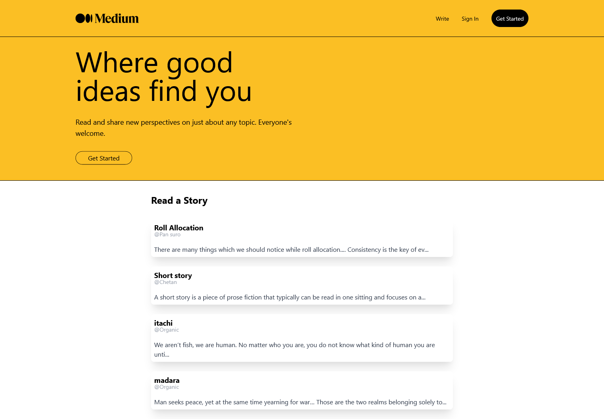

## Medium Clone - [Live Demo](https://medium-clone-dev-e3730.web.app/)

- A simple clone of popular blogging site medium built using React.js, and Firebase.
- Implemented user authentication using Firebase.
- Stored user's data and blogs data in Firestore.

**Features**
- User can write blogs and can also delete blogs that are written by them.
- Users can also read the blogs that are written by other users.

## Tech Stack
* React
* Firebase
* TailwindCSS

## How to run?
1. Create a new project in firebase.
2. Configure the web app by putting your firebase configs in the .env.local file.
3. Then simply run npm install && npm start in the terminal and it should work.

